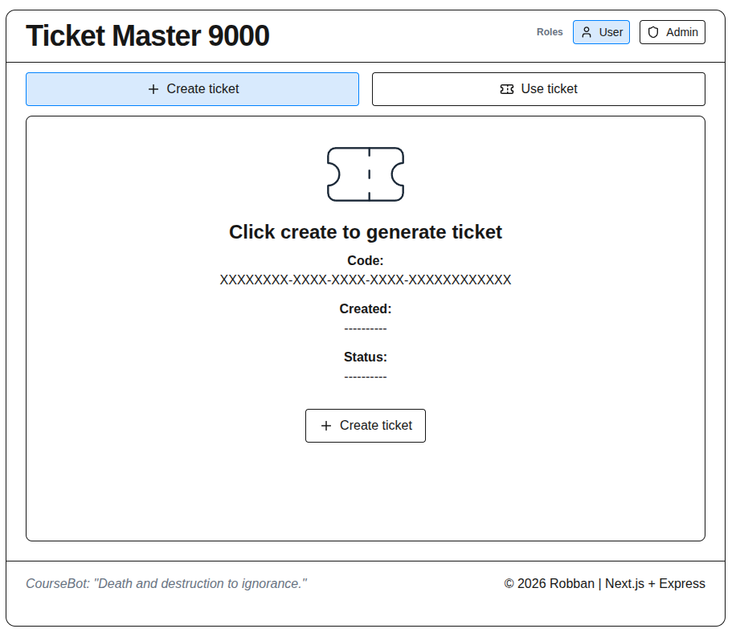
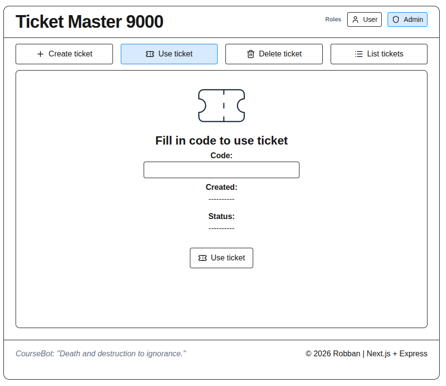
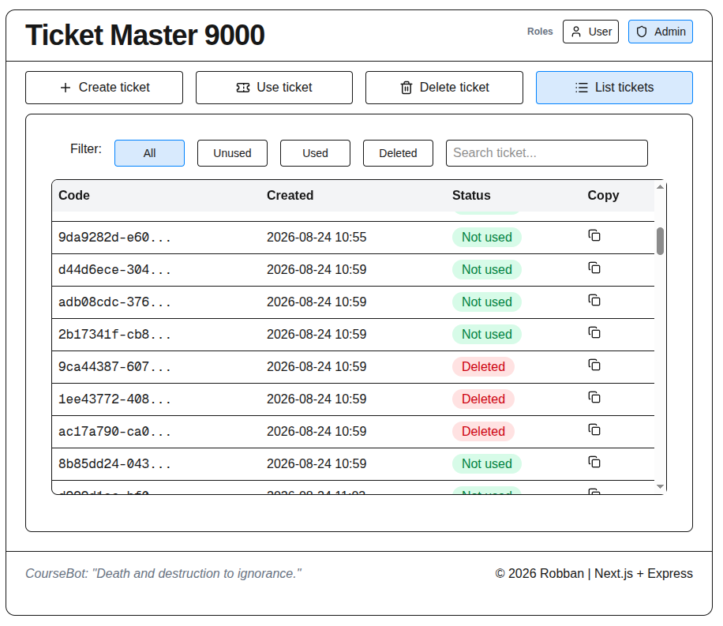

# Ticket Master 9000

## About

Ticket Master 9000 is a full-stack monorepo developed as a Node.js examination project. It consists of a Next.js frontend, an Express.js REST API and a SQLite database used to manage digital tickets.

## How to use

Clone the repository.

Requires Node.js 22 or newer. Frontend runs on http://localhost:3000, backend on http://localhost:3001. Start backend before using the frontend.

### Backend

```bash
cd backend-tm9k
cp .env.example .env
npm install
npm run dev
```

### Frontend

```bash
cd frontend-tm9k
cp .env.local.example .env.local
npm install
npm run dev
```

## How to run tests

### Backend

```bash
cd backend-tm9k
npm test -- --run
```

### Frontend

```bash
cd frontend-tm9k
npm test -- --run
```

## Tech stack

- Next.js
- React
- Express.js
- better-sqlite3
- Vitest
- JavaScript (ES Modules)

## CORS

CORS (Cross-Origin Resource Sharing) allows the frontend to communicate with the backend when they are running on different origins.

During development, the Next.js frontend and the Express.js backend run on different ports. CORS is configured to allow these requests while still protecting the application from requests originating from untrusted origins.

## Wireframe

<p align="center">
  
</p>

## Implemented layout

<p align="center">
  
</p>

<p align="center">
  
</p>

<p align="center">
  
</p>

## Database choice

This project uses **SQLite via better-sqlite3**, as recommended in the assignment. Although the course plan also covers NoSQL, the teacher confirmed that SQLite is acceptable here because the assignment explicitly names better-sqlite3. The integration pattern in Node.js is the same in principle: a database driver, queries, and JSON responses to the frontend.

## Data model

The application uses a SQLite database with one table.

### Database schema

```sql
CREATE TABLE IF NOT EXISTS Tickets
(
    id TEXT PRIMARY KEY,
    createdAt TEXT NOT NULL,
    usedAt TEXT,
    deletedAt TEXT
);
```

### Ticket

| Column | Type | Description |
|---------|------|-------------|
| id | TEXT | UUID. Primary key. |
| createdAt | TEXT | ISO 8601 timestamp when the ticket was created. |
| usedAt | TEXT \| NULL | Timestamp when the ticket was used. `NULL` means the ticket has not been used. |
| deletedAt | TEXT \| NULL | Timestamp for soft deletion. `NULL` means the ticket is active. |

### Ticket lifecycle

```
Created
   │
   ├────────► Used
   │
   └────────► Deleted (soft delete)
```

Active tickets have `deletedAt = NULL`.

Used tickets have `usedAt` set.

Deleted tickets have `deletedAt` set.

The application uses soft delete. Deleted tickets remain in the database, allowing administrators to see historical records while preventing normal use.

## Important decisions

- Authentication and authorization are intentionally omitted since this is a school project.
- Keep it simple, keep it clean.
- Simple UI focused on functionality rather than appearance.
- Layered architecture with loose coupling.
- Soft delete is used instead of permanently removing tickets.
- A development log was used throughout the project.

## Final note

> "Death to ignorance."
>
> — CourseBot