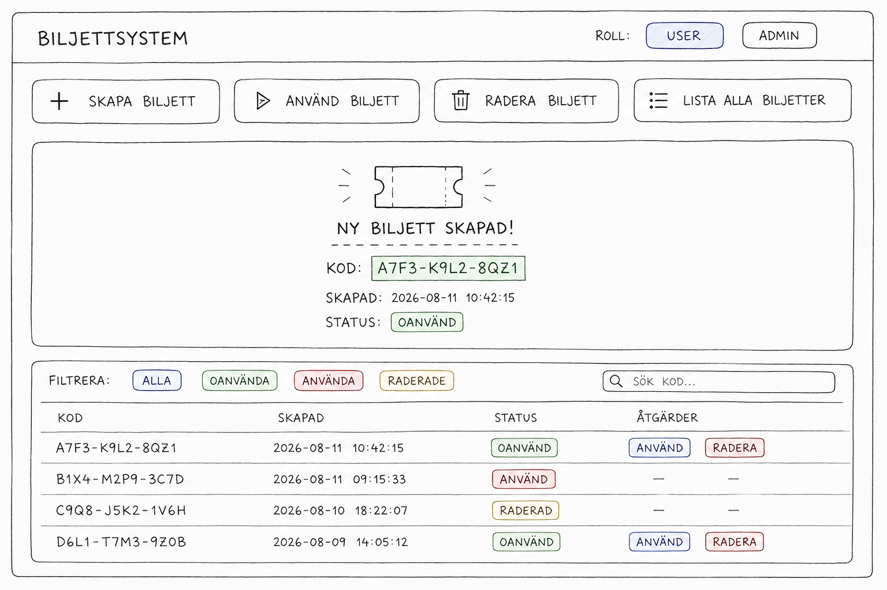

# Ticket Master 9000

## Wireframe

  

## Important decisions

- Since it is a school project. All endpoints are public.
- Keep it simple, keep it clean.
- Layered architecture, loose coupling.
- Use devlog to keep track of progress.

## Final note

"Death to ignorance" - CourseBot